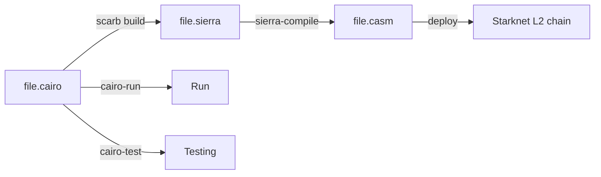

# cairo-playground

Play (code) with Cairo language for writing smart contracts on StarkNet L2 chains.

## Overview

- High level language: _cairo_
- _Sierra_ serves as an intermediate layer between high-level Cairo and compilation targets such as _Cairo Assembly (CASM)_.
- The diagram below is for `.cairo` file:



## Installation

### 1. Scarb

Install `scarb` package manager (inspired from `cargo`).

[SOURCE](https://docs.swmansion.com/scarb/docs/install#quick-installation)

```console
❯ curl --proto '=https' --tlsv1.2 -sSf https://docs.swmansion.com/scarb/install.sh | sh                                                                                            ⏎
scarb-install: retrieving latest version from https://github.com/software-mansion/scarb...
scarb-install: downloading scarb-v0.5.0-aarch64-apple-darwin.tar.gz...
% Total    % Received % Xferd  Average Speed   Time    Time     Time  Current
                                Dload  Upload   Total   Spent    Left  Speed
0     0    0     0    0     0      0      0 --:--:-- --:--:-- --:--:--     0
100 19.9M  100 19.9M    0     0  6316k      0  0:00:03  0:00:03 --:--:--  9.7M
scarb-install: installed scarb to /Users/abhi3700/.local/share/scarb-install/latest
scarb-install: created symlink /Users/abhi3700/.local/bin/scarb -> /Users/abhi3700/.local/share/scarb-install/latest/bin/scarb

Detected your preferred shell is zsh and added '$HOME/.local/bin' to PATH. Run 'source /Users/abhi3700/.zshrc' or start a new terminal session to use Scarb.
Then, run 'scarb --version' to verify your installation. Happy coding!
```

```console
source /Users/abhi3700/.zshrc
```

Verify the installation:

```console
$ scarb --version
```

### 2. Cairo, Starknet toolkits/binaries

There are many binaries available in `bin` folder of [cairo](https://github.com/starkware-libs/cairo) repo, for them we need to install directly.


- `cairo-run`
- `cairo-test`
- `starknet-compile`
- `starknet-sierra-compile`

All the required binaries below can be done at once by following this:

1. Creates binaries: `cairo-run`, `cairo-test`, `starknet-compile`, `starknet-sierra-compile` in `target/release/` folder.

   ```sh
   $ cargo build --release --bin cairo-run
   $ cargo build --release --bin cairo-test
   $ cargo build --release --bin starknet-compile
   $ cargo build --release --bin starknet-sierra-compile
   ```

2. Just call the binaries from the `cairo` repo's cloned directory inside a scarb project like this:

   **M-1**: Using `scarb` pkg manager:

   ```toml
   [scripts]
   hello = "../cairo/target/release/cairo-run --single-file src/hello.cairo"
   ```

   > Recommended to give the absolute path of the binaries w.r.t your mac. But for security reasons, given relative path here. We can use `env` as well. Waiting for better release in future. As of now, this is the best way to use binaries from `cairo` repo.

   **M-2**: Using binary directly:

   1. alias the `absolute path of the cloned target/release binaries`

   ```sh
   # in .zprofile
   $ alias cairorun="absolute/path/to/cairo/target/release/cairo-run"
   $ alias cairotest="absolute/path/to/cairo/target/release/cairo-test"
   $ alias snetcompile="absolute/path/to/cairo/target/release/starknet-compile"
   $ alias snetscompile="absolute/path/to/cairo/target/release/starknet-sierra-compile"
   ```

   And then run `$ source .zprofile` to enable the aliasing.

   2. And then run the hello program like this:

   ```sh
   $ cairorun --single-file src/hello.cairo
   ```

### 3. Editor

#### Extensions

VSCode Extensions:

- [Cairo 1.0 | StarkWare Industries](https://marketplace.visualstudio.com/items?itemName=starkware.cairo1) for language server. Also called "vscode-cairo".
  - Alternatively, can be installed from [Github](https://github.com/starkware-libs/cairo/tree/main/vscode-cairo).
- [Cairo Syntax highlighting | StarkWare Industries](https://marketplace.visualstudio.com/items?itemName=starkware.cairo).

#### Language Server

In order to install [vscode-cairo](https://github.com/starkware-libs/cairo/tree/main/vscode-cairo) for language server, follow this steps:

1. Clone [`cairo` repo](https://github.com/starkware-libs/cairo.git)
2. `$ cd vscode-cairo`
3. `$ npm i`
4. `$ code --install-extension cairo1*.vsix`
5. Now, extension is installed in VSCode.

OR

Directly install the [extension](https://marketplace.visualstudio.com/items?itemName=starkware.cairo1) from VSCode marketplace.

---

After the extension is installed, then do this:

1. Press <kbd>cmd+,</kbd> in VSCode to open the preferences.
2. type "cairo1" & then put the path of `scarb` binary & `cairo-language-server` and save it like this:


Here, the cloned `cairo` repo path should be added here w.r.t your mac absolute location like "~/cairo/target/release/cairo-language-server"

---

Congratulations 🎉, you're all set to write Cairo code in VSCode.

## Getting Started

1. Created a folder like `cairo-playground` (like this repo) and then initialize using `scarb` pkg manager (inspired from `cargo`).

   ```sh
   $ scarb init --name cairo_playground
   ```

   > Note: '-' is not allowed in the name of the project.

2. Write a hello code in Cairo like this:

   

3. Get suggestion, errors and warnings from Cairo language server:

   

4. Once entered, the boilerplate (for instance `fn`) looks like this:
   
5. All the errors can be found via global find in the repo [`Cairo` repo](https://github.com/starkware-libs/cairo) like this:
   
6. Build

   ```sh
   $ scarb build
   ```

   `target/` folder is created containing `target/dev/cairo_playground.sierra` file.

7. Run cargo file:

   ```sh
   ❯ cairo-run --single-file src/lib.cairo                                                                                                           ⏎
   [DEBUG] Hello, world!                   (raw: 0x48656c6c6f2c20776f726c6421

   Run completed successfully, returning []
   ```

8. Test

   ```sh
   ❯ scarb run hello_test
   running 2 tests
   test hello::hello::test_works ... ok
   test hello::hello::test_fails ... ok
   test result: ok. 2 passed; 0 failed; 0 ignored; 0 filtered out;
   ```

9. Deploy code on StarkNet L2 chain #TODO: How to deploy ???

## Topics

### Debug/Print

```cairo
use debug::PrintTrait;

'Hello, world!'.print();
'z'.print();
z.print();
```

When run in CLI, it prints like this:

```sh
# scarb run hello
❯ scarb run func1
[DEBUG] Hello, world!                   (raw: 0x48656c6c6f2c20776f726c6421
[DEBUG] z:                              (raw: 0x7a3a20

[DEBUG] )                               (raw: 0x29

Run completed successfully, returning []
```

Here, all the CLI values are in hex format. So, z = 41 (decimal) is represented as 0x29 (hexadecimal).

### Test

Write tests in the `*.cairo` files like this:

```cairo
#[cfg(test)]
mod tests {
    use super::{add_u8, add_felt252};

    #[test]
    fn test_add_u8() {
        assert(add_u8(1, 2) == 3, '1+2 should be 3');
    }

    #[test]
    #[should_panic(expected: ('1_000_000+2 should be 1_000_002', ))]
    fn test_add_felt252_fails() {
        assert(add_felt252(1_000_000, 2) == 1_000_003, '1_000_000+2 should be 1_000_002');
    }

    #[test]
    #[ignore]
    fn expensive_test() {
         // code that takes an hour to run
    }
}
```

Setup `scarb` to run tests like this:

```toml
#[dependencies]
func1_test = "../cairo/target/release/cairo-test --single-file src/tuts/functions/func1.cairo"
```

Run tests in the CLI

```sh
$ scarb run func1_test
```

### Types

```cairo
// 1. Primitive types
let x: felt252 = 1;

// 2. Arrays
let arr: felt252[10] = [1, 2, 3, 4, 5, 6, 7, 8, 9, 10];
```
