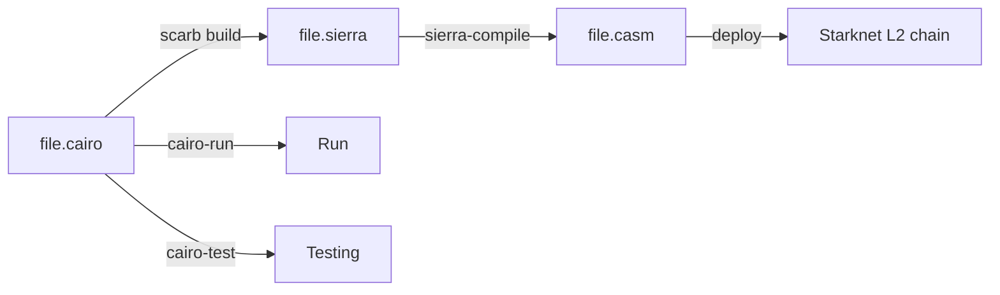
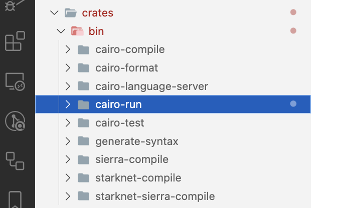
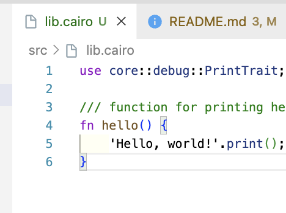
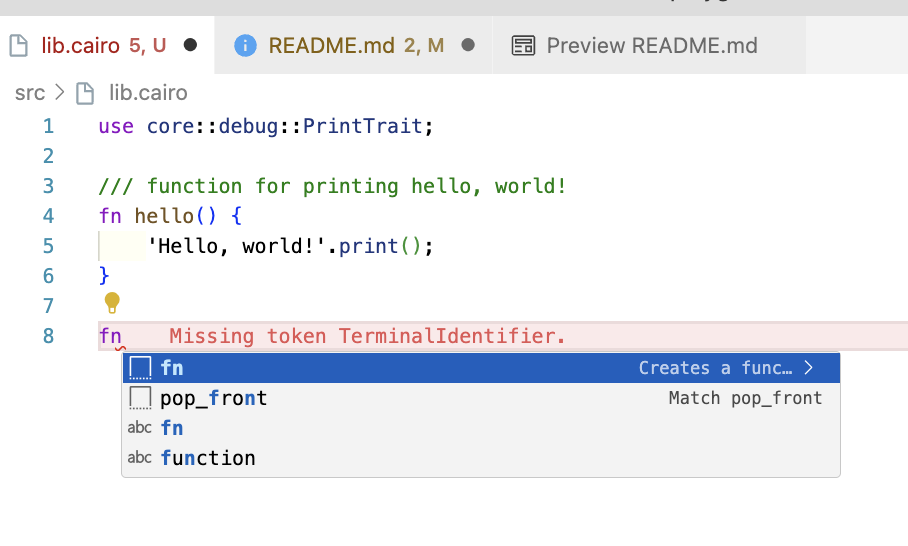
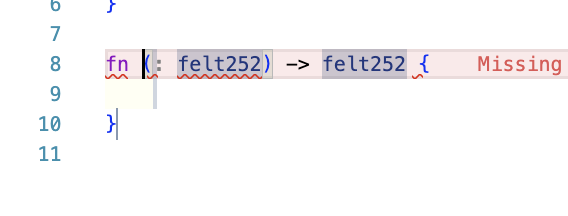
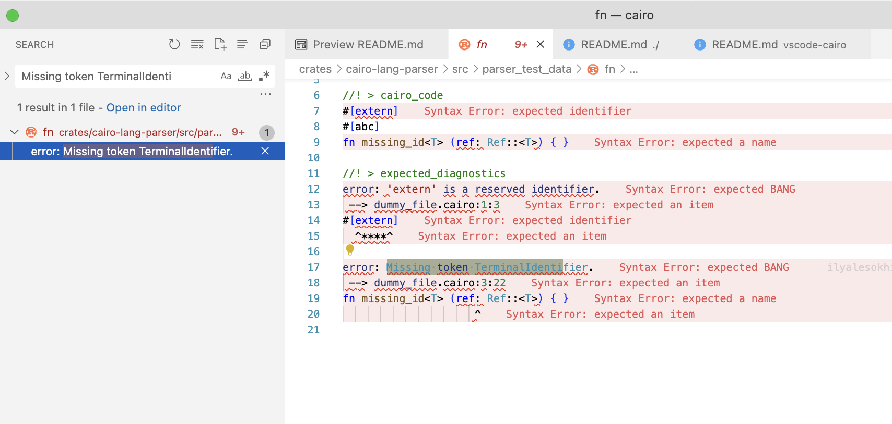

# cairo-playground

Play (code) with Cairo language for writing smart contracts on StarkNet L2 chains.

## Overview

- High level language: _cairo_
- _Sierra_ serves as an intermediate layer between high-level Cairo and compilation targets such as _Cairo Assembly (CASM)_.
- The diagram below is for `.cairo` file:



## Installation

### 1. Scarb

Install `scarb` package manager (inspired from `cargo`).

[SOURCE](https://docs.swmansion.com/scarb/docs/install#quick-installation)

```console
❯ curl --proto '=https' --tlsv1.2 -sSf https://docs.swmansion.com/scarb/install.sh | sh                                                                                            ⏎
scarb-install: retrieving latest version from https://github.com/software-mansion/scarb...
scarb-install: downloading scarb-v0.5.0-aarch64-apple-darwin.tar.gz...
% Total    % Received % Xferd  Average Speed   Time    Time     Time  Current
                                Dload  Upload   Total   Spent    Left  Speed
0     0    0     0    0     0      0      0 --:--:-- --:--:-- --:--:--     0
100 19.9M  100 19.9M    0     0  6316k      0  0:00:03  0:00:03 --:--:--  9.7M
scarb-install: installed scarb to /Users/abhi3700/.local/share/scarb-install/latest
scarb-install: created symlink /Users/abhi3700/.local/bin/scarb -> /Users/abhi3700/.local/share/scarb-install/latest/bin/scarb

Detected your preferred shell is zsh and added '$HOME/.local/bin' to PATH. Run 'source /Users/abhi3700/.zshrc' or start a new terminal session to use Scarb.
Then, run 'scarb --version' to verify your installation. Happy coding!
```

```console
source /Users/abhi3700/.zshrc
```

Verify the installation:

```console
$ scarb --version
```

### 2. Cairo, Starknet toolkits/binaries

There are many binaries available in `bin` folder of [cairo](https://github.com/starkware-libs/cairo) repo, for them we need to install directly.



All the binaries below can be done at once by following this:

1. `$ cargo build --release --bin cairo-run cairo-test starknet-compile starknet-sierra-compile` creates binaries: `cairo-run`, `cairo-test`, `starknet-compile`, `starknet-sierra-compile` in `target/release/` folder.
2. copy all the binaries into `~/.cargo/bin` folder (already added to `$PATH`).

Or else, for individual binaries, follow the steps below:

#### `cairo-run`

1. `$ cargo build --release --bin cairo-run` creates a binary: `cairo-run` in `target/release/` folder.
2. copy the binary `cairo-run` into `~/.cargo/bin` folder (already added to `$PATH`).
3. Now, verify:

```sh
❯ cairo-run --help                                                                                                                                ⏎
Command line args parser.
Exits with 0/1 if the input is formatted correctly/incorrectly.

Usage: cairo-run [OPTIONS] <PATH>

Arguments:
  <PATH>  The file to compile and run

Options:
  -s, --single-file                    Whether path is a single file
      --available-gas <AVAILABLE_GAS>  In cases where gas is available, the amount of provided gas
      --print-full-memory              Whether to print the memory
  -h, --help                           Print help
  -V, --version                        Print version
```

In order to upgrade, just update the repo & start from step-`1`.

#### `cairo-test`

Similar to `cairo-run`,

1. `$ cargo build --release --bin cairo-test` creates a binary: `cairo-test` in `target/release/` folder.
2. copy the binary `cairo-test` into `~/.cargo/bin` folder (already added to `$PATH`).

#### `starknet-compile`

Similar to `cairo-run`,

1. `$ cargo build --release --bin starknet-compile` creates a binary: `starknet-compile` in `target/release/` folder.
2. copy the binary `starknet-compile` into `~/.cargo/bin` folder (already added to `$PATH`).

#### `starknet-sierra-compile`

Similar to `cairo-run`,

1. `$ cargo build --release --bin starknet-sierra-compile` creates a binary: `starknet-sierra-compile` in `target/release/` folder.
2. copy the binary `starknet-sierra-compile` into `~/.cargo/bin` folder (already added to `$PATH`).

### 3. Editor

#### Extensions

VSCode Extensions:

- [Cairo 1.0 | StarkWare Industries](https://marketplace.visualstudio.com/items?itemName=starkware.cairo1) for language server. Also called "vscode-cairo".
  - Alternatively, can be installed from [Github](https://github.com/starkware-libs/cairo/tree/main/vscode-cairo).
- [Cairo Syntax highlighting | StarkWare Industries](https://marketplace.visualstudio.com/items?itemName=starkware.cairo).

#### Language Server

In order to install [vscode-cairo](https://github.com/starkware-libs/cairo/tree/main/vscode-cairo) for language server, follow this steps:

1. Clone [`cairo` repo](https://github.com/starkware-libs/cairo.git)
2. `$ cd vscode-cairo`
3. `$ npm i`
4. `$ code --install-extension cairo1*.vsix`
5. Now, extension is installed in VSCode.

OR

Directly install the [extension](https://marketplace.visualstudio.com/items?itemName=starkware.cairo1) from VSCode marketplace.

---

After the extension is installed, then do this:

1. Press <kbd>cmd+,</kbd> in VSCode to open the preferences.
2. type "cairo1" & then put the path of `scarb` binary & `cairo-language-server` and save it like this:


Here, the cloned `cairo` repo path should be added here w.r.t your mac absolute location like "~/cairo/target/release/cairo-language-server"

---

Congratulations 🎉, you're all set to write Cairo code in VSCode.

## Getting Started

1. Created a folder like `cairo-playground` (like this repo) and then initialize using `scarb` pkg manager (inspired from `cargo`).

   ```sh
   $ scarb init --name cairo_playground
   ```

   > Note: '-' is not allowed in the name of the project.

2. Write a hello code in Cairo like this:

   

3. Get suggestion, errors and warnings from Cairo language server:

   

4. Once entered, the boilerplate (for instance `fn`) looks like this:
   
5. All the errors can be found via global find in the repo [`Cairo` repo](https://github.com/starkware-libs/cairo) like this:
   
6. Build

   ```sh
   $ scarb build
   ```

   `target/` folder is created containing `target/dev/cairo_playground.sierra` file.

7. Run cargo file:

   ```sh
   ❯ cairo-run --single-file src/lib.cairo                                                                                                           ⏎
   [DEBUG] Hello, world!                   (raw: 0x48656c6c6f2c20776f726c6421

   Run completed successfully, returning []
   ```

8. Test #TODO: How to write tests ???
9. Deploy code on StarkNet L2 chain #TODO: How to deploy ???
